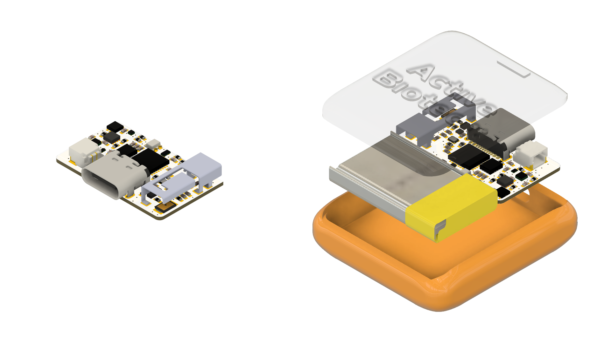
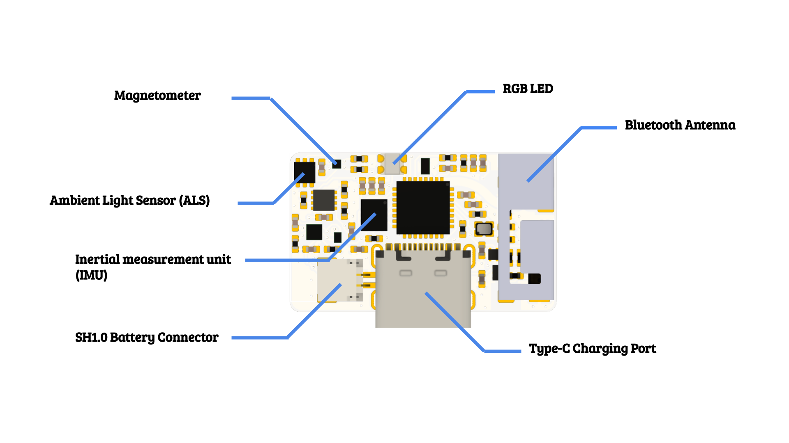

# A-Series Sensor

###Layout

### Technical Specification

> #### General Details

> | Parameter |  |
> | :--- | :--- |
> | **Size (PCB only)** | 25mm x 15mm x 4mm |
> | **Size (with case and battery)** | 32mm x 35mm x 9mm |
> | **LED Type** | RGB LED |
> | **Communication Interface** | BLE 5.0, WIFI |
> | **Charging Interface** | Type-C USB port |
> | **Battery Run Time (recording)** | 4.5 hours |
> | **Battery Run Time (standby)** | 1 week |
> | **Support Battery Type** | lithium battery (3.7V) |

> #### Inertial measurement unit (IMU)

> | Parameter |  |
> | :--- | :--- |
> | **Gyro Noise** | 3.8 mdps/rt-Hz |
> | **Gyro Offset Temp Stability** | &#177 20 mdps/degree c |
> | **Gyro Range** | &#177 2000 dps |
> | **Gyro Resolution** | 16-bits |
> | **Accel Noise** | 70 ug/rt-Hz |
> | **Accel Range** | &#177 16 g |
> | **Accel Resolution** | 16-bits |
> | **Max Output Data Rate** | 8kHz |

> For more details about the command format please refer to the [Inertial measurement unit (IMU)](imu.md) section.

> #### Magnetometer

> | Parameter |  |
> | :--- | :--- |
> | **Full Scale** | &#177 30 G (Gauss) |
> | **Resolution** | 20-bits |
> | **RMS Noise** | 2 mG |
> | **Max Output Data Rate** | 1kHz |

> For more details about the command format please refer to the [Magnetometer (MAG)](imu.md) section.

> #### Ambient light sensor (ALS)

> | Parameter |  |
> | :--- | :--- |
> | **Max Operation Lux** | 60000 lux |
> | **Response WaveLength** | Approximate to human eyes |
> | **Gain** | Programmable |
> | **Integration Time** | Programmable |

> For more details about the command format please refer to the [Ambient Light Sensor (ALS)](als.md) section.

### LED Color Meaning

> Different LED color on the sensor have following meaning:

> | Color | Meaning |
> | :--- | :--- |
> | Green | power up |
> | Blink Red | charging battery |
> | Blink Yellow | BLE advertising |
> | Blink Light Blue | BLE connected |
> | Blink Purple | IMU data streaming |

> BLE advertising LED will stop in 10 minute if no connection happen. (Only LED is off, BLE advertising will continue until sensor enter wake-on-motion mode.)

> The sensor will have different LED blinking speed under charging mode, depend on the battery volume. From fully charged (blinking period 6s) to empty (blinking period 0.15s).

###Wake-On-Motion Mode

> Sensor will sleep without motion detected for 15 minutes, now it is under wake-on-motion mode. If any motion is detected under wake-on-motion mode, sensor will power up (LED Green ~1s) again return to BLE advertising mode (LED blinking yellow).

