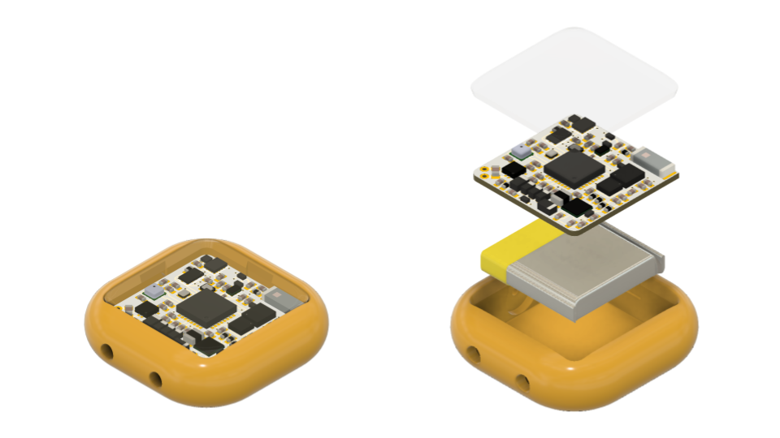
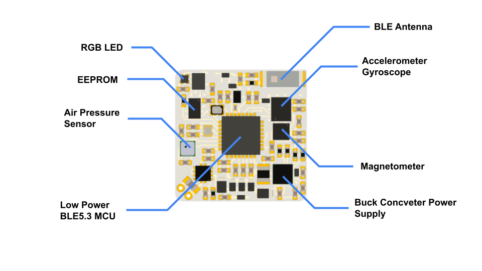

# BLE Sensor - B10 (10 Dof IMU)

###Layout

### Technical Specification

> #### General Details

> | Parameter |  |
> | :--- | :--- |
> | **Size (PCB only)** | 17mm x 17mm x 2mm |
> | **Size (with case and battery)** | 24mm x 24mm x 7mm |
> | **Communication Interface** | BLE 5.0 |
> | **Charging Interface** | Contact Point |
> | **Battery Capacity** | 40mAh |
> | **Battery Type** | Rechargeable Lithium battery |
> | **Battery Life (standby)** | ~4 weeks |
> | **Battery Life (recording - raw data)** | >12 hours |
> | **Battery Recharge Time** | ~2 hours |

> #### Accelerometer

> | Parameter |  |
> | :--- | :--- |
> | **Accel Range** | &#177 16 g |
> | **Accel Resolution** | 16-bits |
> | **Output Data Rate** | 1.6Hz ~ 416Hz |
> | **Accel Noise** | 70 ug/&#8730Hz |

> Supported command in the [Inertial measurement unit (IMU)](imu.md) section.

> #### Gyroscope

> | Parameter |  |
> | :--- | :--- |
> | **Gyro Range** | &#177 2000 dps |
> | **Gyro Resolution** | 16-bits |
> | **Output Data Rate** | 12.5Hz ~ 416Hz |
> | **Gyro Noise** | 3.4 mdps/&#8730Hz |

> Supported command in the [Inertial measurement unit (IMU)](imu.md) section.

> #### Magnetometer

> | Parameter |  |
> | :--- | :--- |
> | **Full Scale** | &#177 50g (gauss) |
> | **Resolution** | 16-bits |
> | **Output Data Rate** | 10Hz ~ 150Hz |
> | **MAG RMS Noise** | 3mg |

> #### Barometric Pressure and Temperature Sensor

> | Parameter | Pressure | Temperature |
> | :--- | :--- | :--- |
> | **Full Scale** | 30kPa ~ 110kPa | -20&#176 ~ 65&#176 |
> | **Resolution** | 16-bits | 15-bits |
> | **Output Data Rate** | 1Hz ~ 256Hz | 1Hz ~ 256Hz |
> | **Absolute Accuracy ** | &#177 20Pa | &#177 0.5&#176 |
> | **Relative Accuracy ** | &#177 1Pa | - |

> Supported command in the [Barometric Pressure and Temperature](press-temp.md) section.

### Default LED Color Meaning

> LED color on the sensor have following meaning on default:

> | Color | Meaning | Duration |
> | :--- | :--- | :--- |
> | White | power up | 5s |
> | Blinking Red | low battery | 1s |
> | Blinking Yellow | BLE advertising | 3min |
> | Blinking Light Blue | BLE connected | forever |
> | Red to Green | charging from 0%(red) to 100%(green) | while charging |

> BLE advertising LED (blinking yellow) will stop in 3 minute if no connection happen. (BLE advertising will continue.)

> Charging LED will turn off after fully charged for 1 hour.

> LED color can be controlled, command described in the [LED](led.md) section.

###Reset the Sensor

> Sensor can be reset with the following procedure:

> Charge the sensor, and then discharge it after 3~4 seconds. If success, white light will turn on for 5 second, otherwise the discharge timing might not be right, try again.

###Sensor Mode and Connectivity

> | Mode | Behavior |
> | :--- | :--- |
> | Shipment | advertising stop, low current consume, activate to advertising mode when charged |
> | Advertising | advertise BLE packet every 1s, ready for connect |
> | Connected | advertising stop, ready for data transfer |

> Shipment mode is a sensor mode that the sensor is stop advertising, and remain in very low current consume, can be activate to advertising mode by plug in the charger.

> New sensor is under shipment mode when received.

> Sensor will stay in advertising mode continuously, and enter shipment mode under the following situation:

> * Battery level is under 6%
> * Received the enter shipment mode command `0x09`

> Each sensor can only connect one device at a time, once it is connected, advertising will stop.

###Charging Socket

