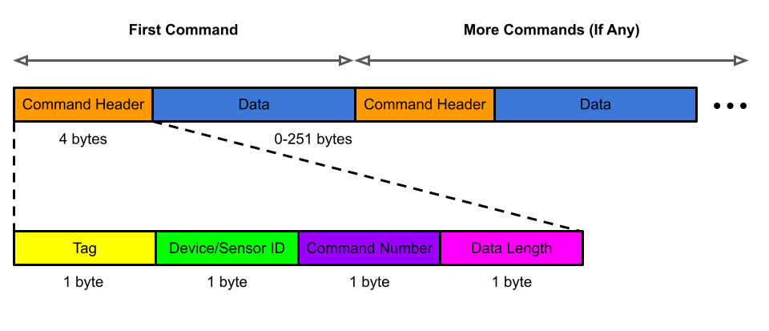

# Bluetooth Interface

This page describe all sensor that use BLE, how the communicate protocol works.

## Bluetooth Device Name

There are two different device name used for a sensor, one is shortened name, used in the advertising. Another is complete name which is saved in the BLE Generic Access Service (UUID: 0x1800), Device Name Characteristic (UUID: 0x2A00).

| B10 Series Sensor | Name | Use in |
| :--- |:--- | :--- |
| Shortened Name | `ABC-B10` | Advertising (Shortened Local Name) |
| Complete Name | `ActiveBiotech-B10` | Generic Access Service |

## Bluetooth UUID

The sensor use two characteristic to receive and send message, it works like a UART interface with the following service and characteristic.

| B10 | UUID |
| :--- |:--- |
| Service - UART | `F32815A0-65BA-4F3C-9EE4-2C2B00AA5AAC` |
| Service - UART (32 bits) | `F32815A0` |
| Characteristic - RX | `F32815A2-65BA-4F3C-9EE4-2C2B00AA5AAC` |
| Characteristic - TX | `F32815A1-65BA-4F3C-9EE4-2C2B00AA5AAC` |

RX is used for sensor to received data and TX is used for sensor to transmit data. For application that use the sensor, activate notifications on the TX characteristic, and write data to the RX characteristic.

Service UUID (32 bits) is included in the advertising data.

## Bluetooth MTU

Default MTU is **20** bytes, maximum MTU is **247** bytes.

Default MTU size is not enough for some command, sensor will request for maximum MTU after connection.

## BLE Connection Parameters

The following parameters are available on the sensor. These parameters can be set by the client directly or using command tag `0x05`.

| Parameters | Range | Default |
| :--- | :--- | :--- |
| Connection Interval | 7.5ms - 4s | 30ms - 45ms |
| Connection Latency | 0 ~ 255 events | 0 event |
| Supervision Timeout | 100ms ~ 25500ms | 5000ms |

Shorter connection interval and latency support faster data output rate but consume more power. Choose the suitable value depend on use case.

Supervision timeout define the time to disconnect when BLE link is lost.

## Command format

Each command that send/receive by the sensor has 4 bytes header follow with the data transfer. At least one command is contained in the transfer. If not specified, always lowest byte send first.

> **Tag**: Represent the meaning of this command, refer to Tag Meaning section for more details.

> ** Device/Sensor ID**: The device/sensor id if there are more than one device/sensor is controlling in this connection. Identify which device/sensor wants to be controlled or which is issuing this command. If there are only one device/sensor, this field is not valid, can be filled as 0x00.

> ** Command Number**: The total number of command in this transfer(notify). One complete commend is command header + data, there may be more than one command in each transfer. If only one command is transfered, fill this byte to 0x01 or 0x00. Only valid and need to be filled at the first command header. This is used for receiving command from sensor, command from application send to the sensor always have **One Command Number** only.

> **Data Length**: How many byte(s) of data is contain in this command. This is a unsigned value.

> ** Data**: Data that contained in this command. For multiple bytes data, if not specified, always lowest byte send first. There can be no data contained in some command. Data format is depend on different tag, described in the **Sensor Command** section.

Command format applicable on both the sensor and the application, you should send command with a proper command format, and received command with the same format from the sensor if any reply. 

Header must include in all communication to the sensor. For example, the command to set the LED color to red is **0x22 00 00 03 ff 00 00**. This is the command with a tag`0x22`, which include 4 bytes header (0x22 00 00 03) and 3 bytes data (0xff 00 00), which is the RGB color.

If a command have no data contained, a shorter format with one byte can be used, instead of complete 4 bytes header. For example, to get the LED color command tag is `0x20`, instead of sending the command as **0x20 00 00 00**, only sending **0x20** is acceptable.

## Tag meaning

| Tag | Meaning | Data Format |
| :--- | :--- | :--- |
| General use | 
| `0x00` | Get product ID and firmware version | [here](general.md#tag-0x00) |
| `0x01` | Ping | [here](general.md#tag-0x01) |
| `0x02` | Check Module | [here](general.md#tag-0x02) |
| `0x03` | Error | [here](general.md#tag-0x03) |
| `0x05` | Request/report BLE connection parameters | [here](general.md#tag-0x05) |
| `0x09` | Enter ship mode | [here](general.md#tag-0x09) |
| Battery | 
| `0x10` | Get/report battery level | [here](general.md#tag-0x10) |
| LED | 
| `0x20` | Get/report LED color | [here](general.md#tag-0x20) |
| `0x21` | Set LED brightness | [here](general.md#tag-0x21) |
| `0x22` | Set LED color and pattern | [here](general.md#tag-0x22) |
| `0x23` | Change LED color | [here](general.md#tag-0x23) |
| `0x24` | Disable/Enable LED | [here](general.md#tag-0x24) |
| IMU |
| `0x30` | Start IMU streaming | [here](imu.md#tag-0x30) |
| `0x31` | Stop IMU streaming | [here](imu.md#tag-0x31) |
| `0x32` | Set IMU offset | [here](imu.md#tag-0x32) |
| `0x36` | Reply Accel and Gyro value | [here](imu.md#tag-0x36) |
| `0x37` | Reply Quaternion 6x | [here](imu.md#tag-0x37) |
| `0x38` | Reply Quaternion 9x | [here](imu.md#tag-0x38) |
| `0x3A` | Start IMU record in storage | [here](imu.md#tag-0x3A) |
| `0x3B` | Stop IMU record in storage | [here](imu.md#tag-0x3B) |
| Storage |
| `0x40` | Read offline data status | [here](storage.md#tag-0x40) |
| `0x41` | Quarter Page Read | [here](storage.md#tag-0x41) |
| `0x42` | Quarter Page Write | [here](storage.md#tag-0x42) |
| Air Pressure and Temperature |
| `0x50` | Start air pressure and temperature streaming | [here](press-temp.md#tag-0x50) |
| `0x51` | Stop air pressure and temperature streaming | [here](press-temp.md#tag-0x51) |
| `0x56` | Reply air pressure and temperature data | [here](press-temp.md#tag-0x56) |
| `0x5A` | Start air pressure and temperature offline record | [here](press-temp.md#tag-0x5A) |
| `0x5B` | Stop air pressure and temperature offline record | [here](press-temp.md#tag-0x5B) |
| TOF |
| `0x60` | Start TOF streaming | [here](tof.md#tag-0x60) |
| `0x61` | Stop TOF streaming | [here](tof.md#tag-0x61) |
| `0x66` | Reply TOF streaming data | [here](tof.md#tag-0x66) |
| EMG |
| `0x70` | Start EMG streaming | [here](emg.md#tag-0x70) |
| `0x71` | Stop EMG streaming | [here](emg.md#tag-0x71) |
| `0x76` | Reply EMG streaming data | [here](emg.md#tag-0x76) |
| Resistive Sensor |
| `0x80` |
| `0x81` |
| `0x82` |

