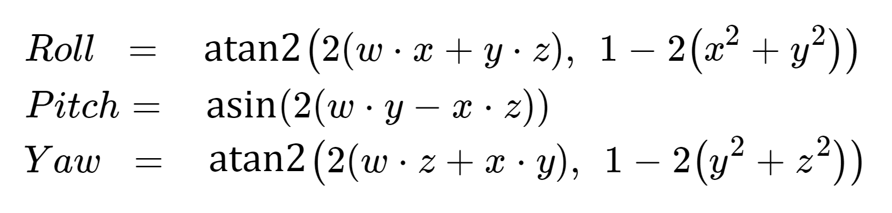

# IMU Command

Tag `0x30`-`0x3f` command for Inertial measurement unit (IMU) are explained in this page.

---

### Keyword

> **NA**: Not applicable, this command should no be sent by the sensor/application.

> **None**: No data contained in this command, data length can be set as 0x00.

---

### Tag `0x30`

> **Meaning:**	
> Start recording from IMU. Recording continue until user call the stop recording command tag `0x31`. Data replay from IMU will use tag `0x35`-`0x38`.

> **Data format - app send:**  

> | Byte Length | 1 | 1 | 1 | 1 | 1 |
> | :--- | :--- | :--- | :--- | :--- | :--- |
> | **Meaning** | Accel ODR | Accel FS | Gyro ODR | Gyro FS | reply format |

> Output Data Rate (ODR), Full Scale (FS) and reply format code listed below, they should be supplement to 1 byte in the command.

> | Accel ODR / Hz | code | Accel FS / +-g | code |
> | :--- | :--- | :--- | :--- |
> | ~~8000~~ | 0x03 | 16 | 0x00 |
> | ~~4000~~ | 0x04 | 8 | 0x01 |
> | ~~2000~~ | 0x05 | 4 | 0x02 |
> | ~~1000~~ | 0x06 | 2 | 0x03 |
> | 500 | 0x0f |
> | 200 | 0x07 |
> | 100 | 0x08 |
> | 50 | 0x09 |
> | 25 | 0x0a |
> | 12.5 | 0x0b |
> | 6.25 | 0x0c |
> | 3.125 | 0x0d |
> | 1.5625 | 0x0e |

> | Gyro ODR / Hz | code | Gyro FS / +-g | code |
> | :--- | :--- | :--- | :--- |
> | ~~8000~~ | 0x03 | 2000 | 0x00 |
> | ~~4000~~ | 0x04 | 1000 | 0x01 |
> | ~~2000~~ | 0x05 | 500 | 0x02 |
> | ~~1000~~ | 0x06 | 250 | 0x03 |
> | 500 | 0x0f | 125 | 0x04 |
> | 200 | 0x07 | 62.5 | 0x05 |
> | 100 | 0x08 | 31.25 | 0x06 |
> | 50 | 0x09 | 15.625 | 0x07 |
> | 25 | 0x0a |
> | 12.5 | 0x0b |

> | Reply data format | code | reply tag |
> | :--- | :--- | :--- |
> | Raw data | 0x00 | `0x35` |
> | Accel and Gyro value | 0x01 | `0x36` |
> | Quaternion | 0x02 | `0x37` |
> | ~~Euler angle~~ | 0x03 | `0x38` |

> If using reply format _"Quaternion"_ or _"Euler angle"_, recording always start from default orientation (IMU facing upward). Use command tag `0x32` to set the zero position after start recording.

> **Data format - app receive:**  
> NA

---

### Tag `0x31`

> **Meaning:**  
> Stop recording from IMU.

> **Data format - app send:**  
> None

> **Data format - app receive:**  
> Same as send format.

> Same format will acknowledge to the user after command is executed.

---

### Tag `0x32`

> **Meaning:**  
> Set zero to the recording IMU. Only works for _"Quaternion"_ and _"Euler angle"_ reply format. This command should send at IMU running.

> **Data format - app send:**  

> | Byte Length | 1 |
> | :--- | :--- |
> | **Meaning** | Zero Position |

> | Zero Position | Code |
> | :--- | :--- |
> | Current Position | 0x00 |
> | +X-axis | 0x01 |
> | -X-axis | 0x02 |
> | +Y-axis | 0x03 |
> | -Y-axis | 0x04 |
> | +Z-axis | 0x05 |
> | -Z-axis | 0x06 |

> Zero position is the position that all pitch, roll and yaw angle equal to zero.

> Note that zero position vector of the sensor is pointing upward (opposite to the direction of gravity). For example, if the ICs on sensor is upward, and this is the zero position, then +Z-axis should be set as the zero position.

> **Data format - app receive:**  

> | Byte Length | 4 | 4 | 4 |
> | :--- | :--- | :--- | :--- |
> | **Meaning** | Zero Position X | Zero Position Y | Zero Position Z |

> After zero position set, it will return the position it set. Zero will return when this command is called not under IMU recording mode.

---

### Tag `0x35`

> **Meaning:**  
> Reply IMU data in raw data format.

> **Data format - app send:**  
> NA

> **Data format - app receive:**  

> | Byte Length | 6 | 6 | 4 |
> | :--- | :--- | :--- | :--- |
> | **Meaning** | Accel data | Gyro data | TMST |

> Accel and Gyro data separated in X, Y, Z axis, each axis has 2 bytes, total in 6 bytes. For more details conversion method please refer to the ICM42605 data sheet.

> TMST is time stamp. It is 4 bytes unsigned integer , represent us between current data and last data.

---

### Tag `0x36`

> **Meaning:**  
> Reply IMU data in accelerometer(ms^-2) and gyroscope(degree/s) value format.

> **Data format - app send:**  
> NA

> **Data format - app receive:**  

> | Byte Length | 12 | 12 | 4 |
> | :--- | :--- | :--- | :--- |
> | **Meaning** | Accel value | Gyro value | TMST |

> Accelerometer(ms^-2) and gyroscope(rad/s) value separated in X, Y, Z axis, each axis has 4 bytes, total in 12 bytes, all in Float format.

> TMST is time stamp. It is 4 bytes unsigned integer , represent us between current data and last data.

---

### Tag `0x37`

> **Meaning:**  
> Reply IMU data in quaternion data format.

> **Data format - app send:**  
> NA

> **Data format - app receive:**  

> | Byte Length | 16 |
> | :--- | :--- |
> | **Meaning** | Quaternion |

> Quaternion contains 4 Float value, 4 bytes each.

> To convert the quaternion into Euler angle, assume quaternion values are w, x, y and z, and then use the equations below:

> 

> It is suggested to add some check code to make sure that the value is valid in *asin* and *atan2*, otherwise math error might happen due to the floating point precision issue.

---

### Tag `0x38`

> **Meaning:**  
> Reply IMU data in Euler angle data format.

> **Data format - app send:**  
> NA

> **Data format - app receive:**  

> | Byte Length | 4 | 4 | 4 |
> | :--- | :--- | :--- | :--- |
> | **Meaning** | Roll | Pitch | Yaw |

> Each Euler angle return in Float. Unit is degree.

---

