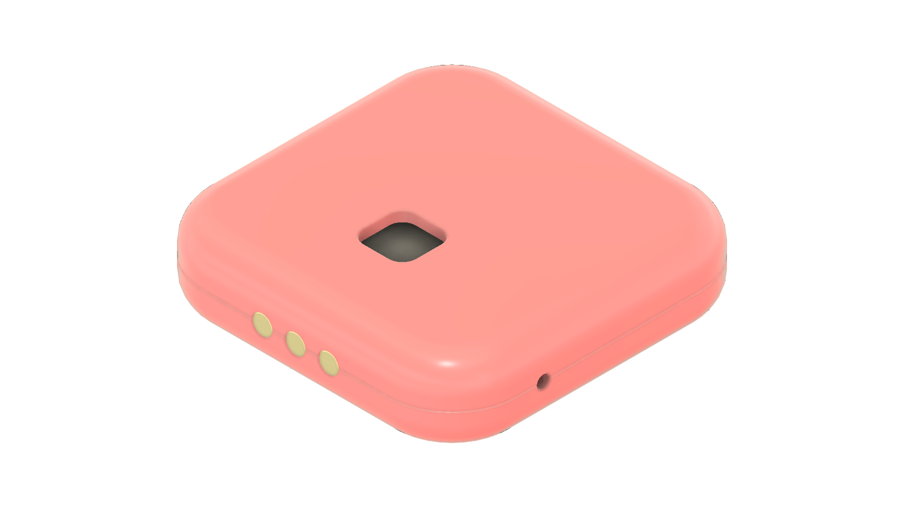
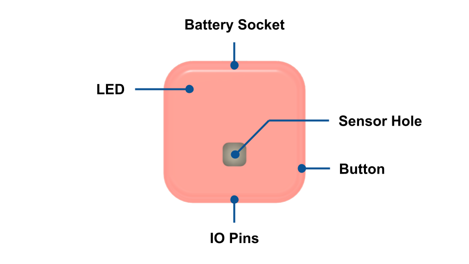
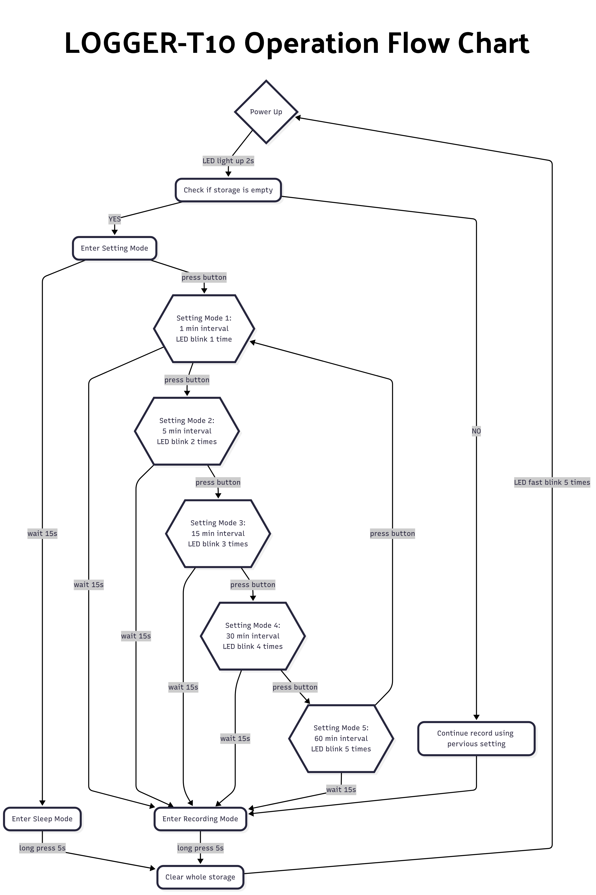
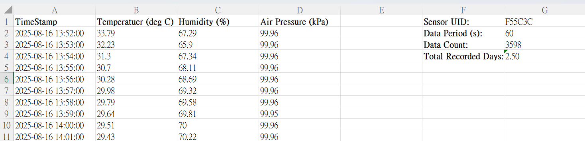
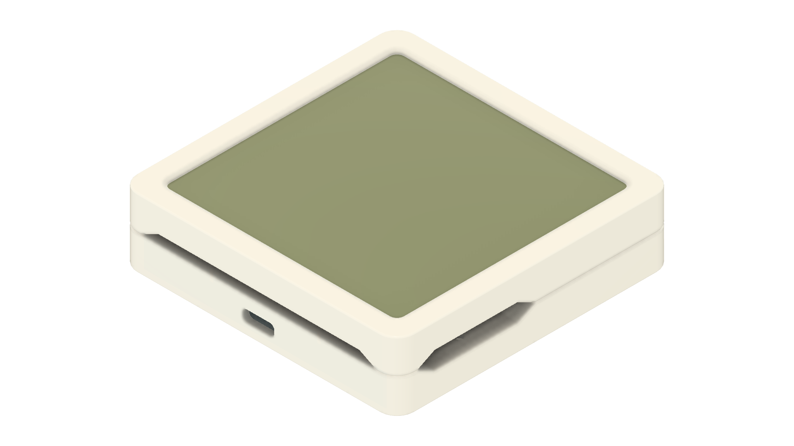
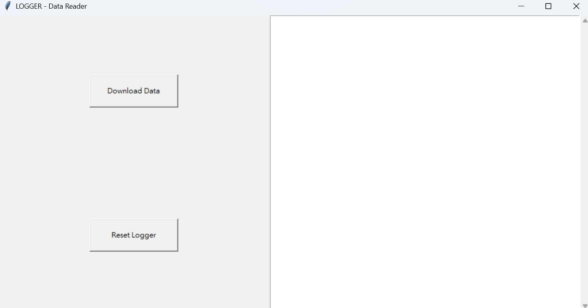
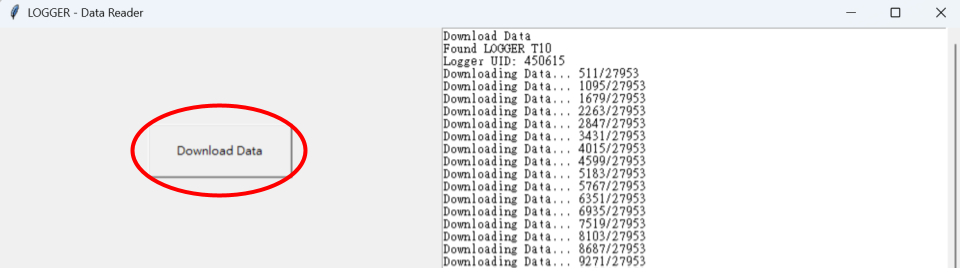

# Logger - T10 (Temperature, Humidity, Air Pressure)

###Description
The Logger Series is a remarkably compact and slim sensor designed for uninterrupted, offline data recording over extended periods. Powered by a high-density, non-rechargeable lithium battery, each unit can continuously log data for up to three years. It's lightweight form makes it ideal for integration into wearable devices. It also serves as a reliable tool for scientific research. Onboard memory securely stores readings until you're ready to retrieve them. Data extraction is seamless simply dock the logger into its dedicated reader to offload and review your results.

The Logger-T10 is a sensor in Logger Series designed to record temperature, humidity, and air pressure data with precision.

### Layout

### Technical Specification

> #### General Details

> | Parameter |  |
> | :--- | :--- |
> | **Size** | 24mm x 24mm x 6.2mm |
> | **Battery Type** | CR1625 Non-Rechargeable Lithium Battery |
> | **Battery Capacity** | 90mAh |
> | **Battery Life (recording)** | ~2 years |
> | **Data Type** | Temperature, Humidity, Air Pressure |
> | **Recording Period** | 1s to 1hour |

> #### Temperature Sensor

> | Parameter | |
> | :--- | :--- |
> | **Temperature Range** | -10&deg;C to 50&deg;C |
> | **Temperature Resolution** | 16 bits |
> | **Temperature Accuracy** | &#177 0.1&deg;C |

> #### Humidity Sensor

> | Parameter | |
> | :--- | :--- |
> | **Humidity Range** | 0% to 100% |
> | **Humidity Resolution** | 16 bits |
> | **Humidity Accuracy** | &#177 0.15% |

> #### Air Pressure Sensor

> | Parameter | |
> | :--- | :--- |
> | **Air Pressure Range** | 260 to 126kPa |
> | **Air Pressure Resolution** | 24 bits |
> | **Air Pressure Accuracy** | &#177 0.02kPa |

> #### Battery and Storage Life

> | Period | Storage Capacity Life | Battery Life |
> | :--- | :--- | :--- |
> | 1min | 1.14 years | 2.43 years |
> | 5min | >3.35 years | 3.35 years |
> | 15min | >3.5 years | 3.5 years |
> | 30min | >3.5 years | 3.5 years |
> | 1hour | >3.5 years | 3.5 years |

> Battery life is calculated under ideal situation, no operation during data recording. Operation like download data, restart the logger, blinking LED during recording will consume extra power and make the battery shorter than calculated.

### Operation Flow Chart

### Key Concept

> #### Modes

> There are 3 different modes for the logger, explained as follow:

> | Logger Mode | Blink Indicate |
> | :--- | :--- |
> | SETTING MODE | - |
> | SLEEP MODE | 1 |
> | RECORDING MODE | 2 |

>> ##### SETTING MODE

>> | Settings | 0 | 1 | 2 | 3 | 4 | 5 |
>> | :--- | :--- | :--- | :--- | :--- | :--- | :--- |
>> | Meaning | SLEEP | 1min | 5min | 15min | 30min | 1hour |

>> **SETTING MODE** enter at startup, allowing the user to configure the data logging interval. The mode begins at 0, which represents no button press. Each press of the setting pin-hole advances the logger to the next setting mode, cycling from 1 to 5. If the button is pressed while in mode 6, the logger loops back to mode 1. To indicate the current mode, the logger's LED blinks a number of times corresponding to the selected mode. It's important to wait until the LED finishes blinking before pressing the button again to avoid miss-selection. If no button is pressed for 15 seconds, the logger exits setting mode and applies the selected configuration to determine the sensor's next operational behavior.

>> ##### SLEEP MODE
 
>> When setting 0 is selected during **SETTING MODE**, the logger transitions into **SLEEP MODE**, effectively pausing all active operations. In this state, the logger remains idle but still accessible-external readers can communicate with it and issue commands. To check the current mode while in sleep, pressing the pin-hole button will trigger the LED to blink once, confirming that sleep mode is active. If the user wishes to restart the logger from sleep, they can press and hold the pin-hole button for more than 5 seconds, then release it, this action reactivates the logger.

>> ##### RECORDING MODE

>> When modes 1 to 5 are selected in **SETTING MODE**, the logger automatically enters **RECORDING MODE**. In this mode, it logs data at the interval chosen during setup and stores each entry in internal storage. Pressing the pin-hole button causes the LED to blink twice, confirming that recording is active. The logger remains accessible throughout RECORDING MODE, so you can export data without interrupting the ongoing logging process.

> #### Clear Internal Storage and Restart

> There are two way to clear the storage, first is plug the logger into the reader socket and click the "Clear Internal Storage" button in the Logger Reader application. Once the clearing procedure finishes, the logger will automatically enter sleep mode, awaiting your next operation.

> Second is press the pin-hole button for 5s under **SLEEP MODE** and **RECORDING MODE**, logger will clear whole storage and restart.

> #### Replacing Battery

> The logger use CR1625 lithium battery, simply plug a pin into the hole behind the the logger, push the battery out to replace a new battery.

> #### Exporting Data

> To export your logger's recorded data, plug it into the **Logger Socket**, launch the Logger Reader Application, and click the download button. The software will retrieve all stored measurements and automatically save them as an Excel (.xlsx) file in the same folder where the Logger Reader executable resides. The generated filename includes your logger's ID and recording dates for easy identification. It might takes about 10 minutes to download all data if the storage is full, download time depends on the amount of data recorded. After the export finishes, close the application and safely eject the logger to avoid any risk of file corruption.

> 

> #### TimeStamp

> When you export data from the logger, each measurement is stamped with its exact date and time. However, if the battery depletes before you download the logged data, the timestamps will be missing. To guard against this risk-especially during long-term monitoring-it's recommended to note the exact start time of the recording session. With that reference, you can reconstruct or estimate any missing timestamps and preserve the continuity of your dataset.

# Logger Socket and Data Reader Application

LOGGER Socket is the device that use to download recorded data from LOGGER-T10, there are display panel on the device that can display current temperature, humidity and air pressure when LOGGER-T10 is plugged in.

LOGGER Data Reader is the software that work with the LOGGER Socket, use to export data or reset the logger. The application can be downloaded here:

[>>Download<<](files/Logger Data Reader.exe)

###How to Use

> 

> To download your data, connect the reader socket to your computer using a USB-C cable, attach the logger to the socket, then open the Logger Reader software and click the Download button. A progress indicator will appear during the transfer, once it finished, you can safely unplug the logger.

> To reset the logger, follow the same procedure as download data, and then press the Reset Logger button. Once the logger is reset, whole storage will clear, and then change to sleep mode.

###FAQ

> **Q: How to know the logger current operation situation?**

> A: Press the pin-hole button, if LED blink once time, logger is in sleep mode, it LED blink twice, logger is in recording mode.

> **Q: How to enter recording mode while logger is in sleep mode?**

> A: Long press the pin-hole button 5s, the logger will fast blink 5 times indicate that restart success. Logger is in setting mode after restart, choose the require period by pressing the pin-hole button.

> **Q: Logger not response after restart.**

> A: If the storage already store many data, it might takes some time for the logger to restart, wait 5min after batter inserted for further operation.

