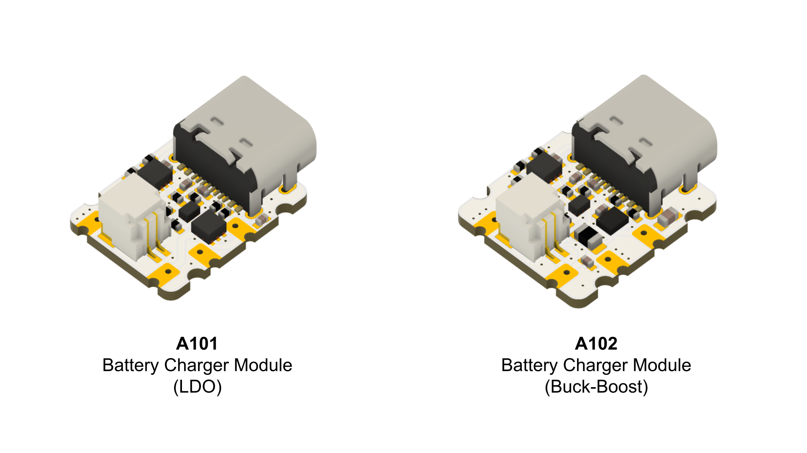
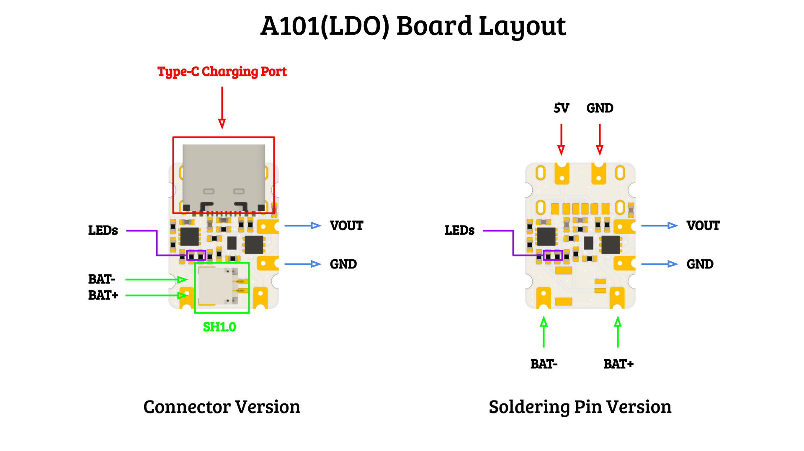
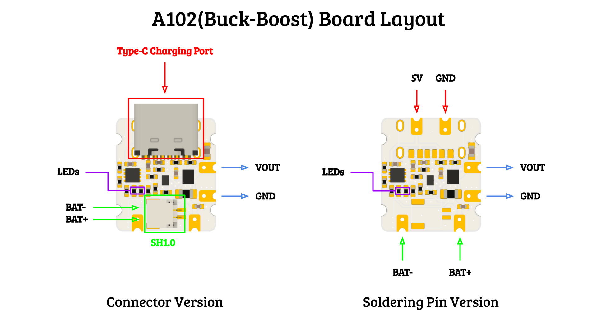

# Battery Charger Module

### Details

> A101 and A102 are tiny battery charger module, with the following function:

> * Battery Charging
> * Voltage Supervision
> * DC/DC Voltage Conversion

#### Battery Charging

> A101 and A102 support 1s Lithium polymer battery, this board provide charging and discharge function to the battery. Charging current is adjustable by changing the resistor value on the board, form 50mA to 800mA, default is set to 100mA. Charging input voltage is 5V and can be connected through the Type-C port or the soldering pin on board.

#### Voltage Supervision

> Voltage supervision is a voltage monitor function that can stop the output when the battery voltage falls below a certain threshold, and recover the output when battery voltage raise again. For the LDO version, the default cut-off voltage is 3.08V, recovery voltage is 3.4V. For the Buck-Boost version, the default cut-off voltage is 2.75V, recovery voltage is 3.3V. Both voltage threshold can be adjusted by changing the resistor value on board.

#### DC/DC Voltage Conversion

> The board provide voltage conversion function, the output voltage can be adjusted to fit different requirements. The default output voltage is 3.3V for both version. Max output current is 1A.

### Layout

### Technical Specification

> #### Battery Charging

> | Parameter | A101 / A102 |
> | :--- | :--- |
> | Charging Port | Type-C / Soldering Pin |
> | Battery Port | SH1.0 / Soldering Pin |
> | Charging Input Voltage | 5V |
> | Charging Current | 50mA to 800mA (default 100mA) |

> #### Voltage Supervision

> | Parameter | A101 | A102 |
> | :--- | :--- | :--- |
> | Cut-off Voltage | 3.08V | 2.75V |
> | Recover Voltage | 3.4V | 3.3V |

> #### DC/DC Voltage Conversion

> | Parameter | A101 | A102 |
> | :--- | :--- | :--- |
> | Voltage Conversion Method | LDO | Buck-Boost |
> | Output Port | Soldering Pin | Soldering Pin |
> | Output Voltage | 0.55V - 3.3V | 2.3 - 5.3V |
> | Default Output Voltage | 3.3V | 3.3V |
> | Max Output Current | 1A | 1A |

