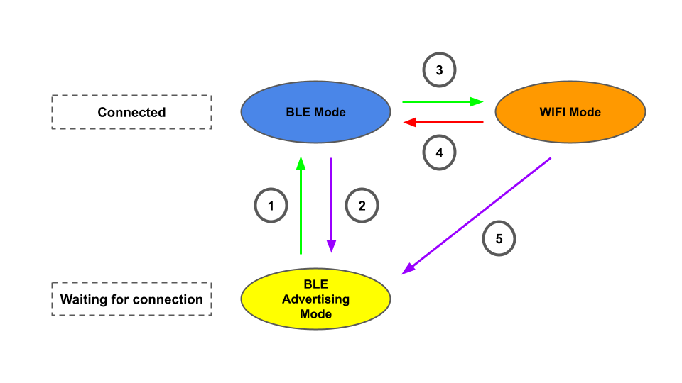

#WIFI Interface

This page describe all sensor that use WIFI, how the communicate protocol works.

##WIFI Parameters

| Parameters |  |
| :--- | :--- |
| Protocol | UDP |
| IP | User setting |
| Port | 9370 |

The IP used by the sensor can be set by command, for more details please check [WIFI command format](wifi-command.md) section.

##WIFI Operation Concept

To enter WIFI mode of this sensor, first need to setup the WIFI configuration (SSID, PW and IP at tag`0x62` - tag`0x64`) under BLE mode. Sensor will save the setting into its EEPROM, that can be used for next connection, so the WIFI configuration only need to be set on the first time.

After the WIFI configuration is set, use the start WIFI mode command (tag`0x60`) to enter WIFI mode. When the WIFI mode is finished call the stop WIFI mode command (tag`0x61`), sensor will disconnect from WIFI and return to BLE advertising mode.

In order to achieve WIFI mode, sensor need to connect with BLE first .Following is the explain of the transaction between modes of the sensor.

1. When BLE connected, the sensor will go to BLE mode.
2. When BLE disconnected, sensor return to BLE advertising mode.
3. When WIFI start command (tag`0x60`) is called, sensor will try to enter WIFI mode.
4. When enter WIFI mode unsuccess, e.g. wrong SSID, PW, sensor return to BLE mode.
5. When disconnected from WIFI mode, sensor return to BLE advertising mode.

##Steps of enter/exit WIFI mode

1. Connect the sensor with BLE.
2. Set the router SSID, PW and IP (tag`0x62` - tag`0x64`) used for the WIFI connection. (can be skipped if set before)
3. Call the WIFI start command (tag`0x60`).
4. Call the WIFI stop command (tag`0x61`) to disconnect from WIFI mode.

